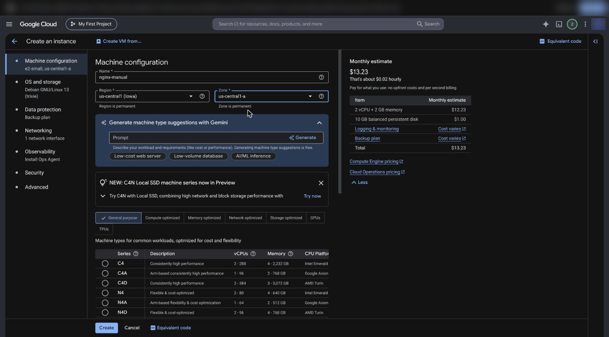
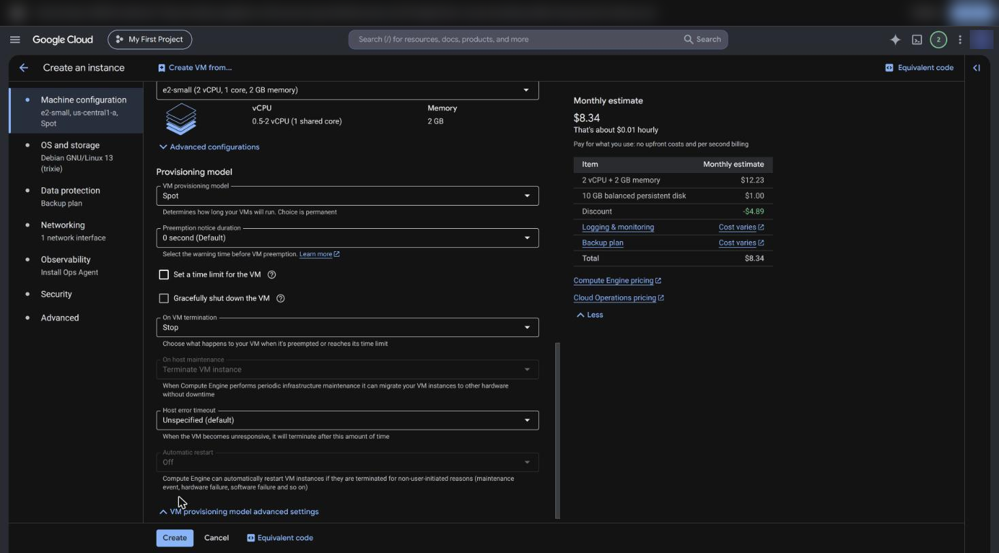
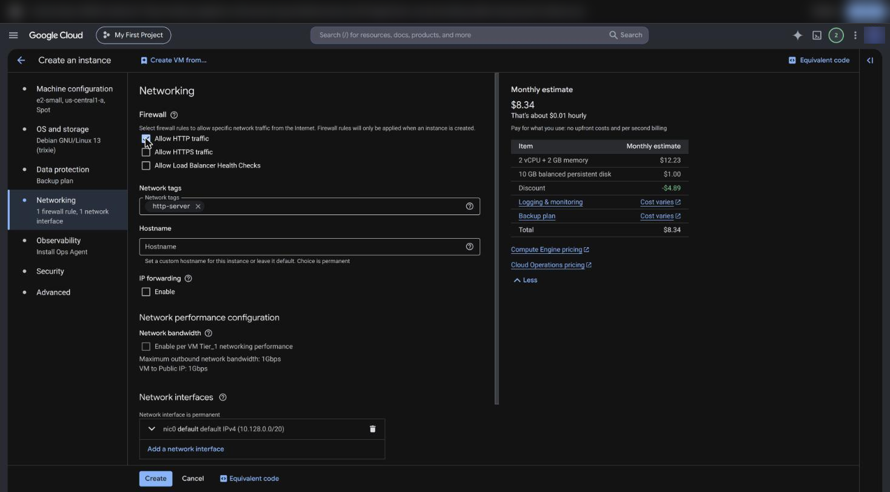
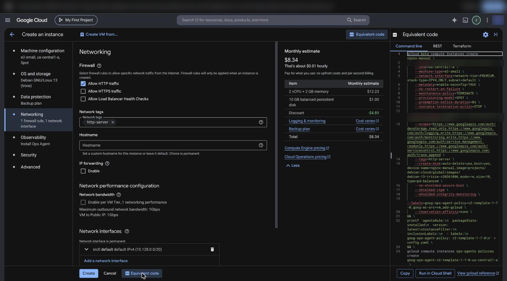
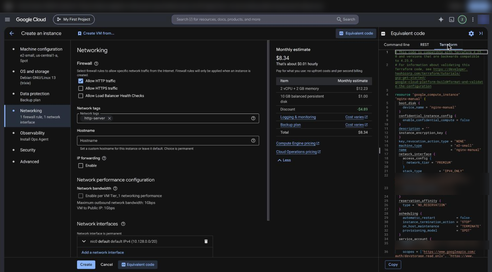
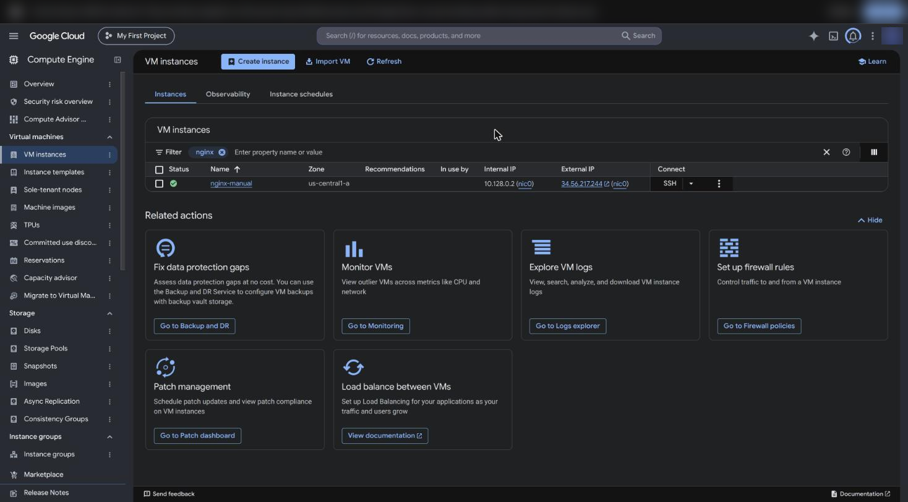
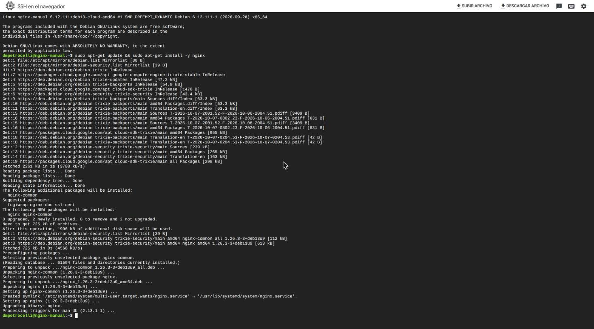
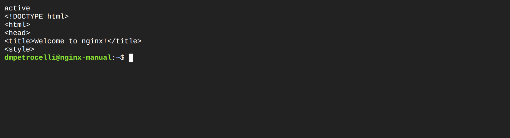
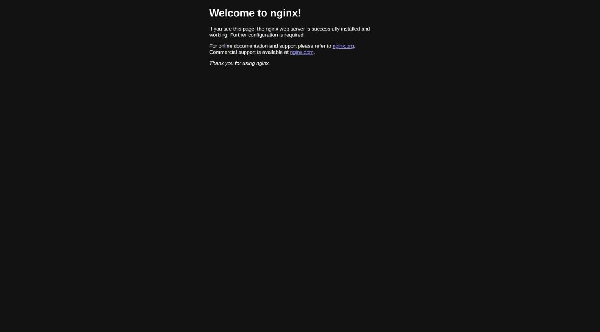

# Clase 2: IaC con OpenTofu/Terraform sobre GCP

## Objetivo

Lo que hiciste a mano en la clase 1 (red, firewall, VM, disco, montarlo,
correr el contenedor) ahora es código. `plan` te muestra qué va a cambiar
**antes** de tocar nada, y el estado queda en un bucket compartido.

Al terminar tenés:

1. `terraform/envs/dev` validado sin nube (offline).
2. Un `plan` y un `apply` reales de la red, el registry y la VM, con el estado en GCS.
3. Un ejemplo de *drift* detectado por `plan`.
4. Tu artefacto: el mismo módulo `vm` instanciado en un entorno nuevo, con otras
   variables (la receta está en el lab de tu aula, Parte 4).

Todo funciona igual con `tofu` (OpenTofu) o `terraform`: donde dice `tofu`,
podés escribir `terraform`.

## Prerrequisitos

- [ ] OpenTofu ≥ 1.6 (`tofu version`) o Terraform ≥ 1.6 (`terraform version`).
- [ ] Estás en la raíz del repo.
- [ ] Para la parte en la nube: gcloud logueado (`gcloud config get-value project`
      muestra tu proyecto). La imagen `app:v1` recién hace falta para el
      servicio patrón (clase 3); el Paso 0 no la necesita.

## Paso 0: un servidor web, primero a mano y después con código

La idea de toda la clase en un solo ejercicio: una VM con nginx que contesta
desde internet. Primero la armás a mano (consola + SSH), después la misma VM
sale de `terraform/envs/dev` y `terraform/envs/prod` con un `tofu apply`.

Usamos **`us-central1`** (de las regiones más baratas) y VMs **Spot**
(mucho más baratas; a cambio, GCP las puede apagar en cualquier momento).

### A. A mano, desde la consola de GCP

**1.** Compute Engine → VM instances → **Create instance**. Nombre
`nginx-manual`, región `us-central1 (Iowa)`, zona `us-central1-a`, serie
**E2**, tipo `e2-small`.



**2.** Más abajo, en **Provisioning model**, elegí **Spot**. Mirá cómo baja el
estimado mensual.



**3.** En **Networking**, tildá **Allow HTTP traffic**. La consola le pone el
tag `http-server` a la VM y crea la regla de firewall `default-allow-http`
(puerto 80).



**4.** Antes de crear, abrí **Equivalent code**: la consola te muestra el mismo
pedido como comando `gcloud`…



…y como **Terraform**. Esto es lo que vamos a escribir nosotros, más prolijo.



**5.** **Create**. En un minuto la VM está corriendo con una IP externa.



**6.** Botón **SSH** de la fila, y adentro de la VM:

```bash
sudo apt-get update && sudo apt-get install -y nginx
```



```bash
systemctl is-active nginx
curl -s localhost | head -5
```



**7.** Desde tu navegador: `http://<IP-externa>/`



Lo mismo por línea de comandos, si preferís:

```bash
gcloud compute instances create nginx-manual --zone=us-central1-a \
  --machine-type=e2-small --provisioning-model=SPOT \
  --instance-termination-action=STOP --tags=http-server
gcloud compute firewall-rules create default-allow-http \
  --network=default --allow=tcp:80 --target-tags=http-server
gcloud compute ssh nginx-manual --zone=us-central1-a \
  --command='sudo apt-get update && sudo apt-get install -y nginx'
```

Preguntate: ¿cuántos clics y comandos fueron? ¿Quién se acuerda de ellos en un
mes? ¿Cómo sabés que la VM de tu compañero quedó igual que la tuya?

**8. Borrala** (cuesta plata mientras exista):

```bash
gcloud compute instances delete nginx-manual --zone=us-central1-a --quiet
gcloud compute firewall-rules delete default-allow-http --quiet
```

### B. Lo mismo con código: `envs/dev` y `envs/prod`

El módulo `vm` tiene dos modos. Si **no** le pasás imagen
(`servicio_patron_image` vacío), el script de arranque hace lo que hiciste por
SSH: instala nginx y lo deja en el puerto 80. Desde la clase 3 le pasás la
imagen y corre el servicio patrón en Docker.

```bash
export PROJECT_ID="mi-proyecto-123"
gcloud auth application-default login
gcloud services enable compute.googleapis.com storage.googleapis.com
gcloud storage buckets create "gs://${PROJECT_ID}-tfstate" --location=us-central1 --uniform-bucket-level-access

cd terraform/envs/dev
cp backend.hcl.example backend.hcl    # bucket = "<tu-proyecto>-tfstate"
cp dev.tfvars.example dev.tfvars      # project_id; servicio_patron_image vacío
tofu init -backend-config=backend.hcl
tofu plan -var-file=dev.tfvars -out=dev.plan    # leelo antes de aplicar
tofu apply dev.plan
curl "$(tofu output -raw vm_url)"               # esperá 1-2 min a que termine apt
```

En el plan buscá `provisioning_model = "SPOT"` y, en el `metadata_startup_script`,
el `apt-get install -y nginx`: son tus clics y tu SSH, ahora como código.

**prod** usa los mismos módulos con otro estado y otros nombres. Por defecto
prod no crea la VM (en la clase 8 solo necesita el cluster), así que para esta
clase la prendés y apagás el cluster:

```bash
cd ../prod
cp backend.hcl.example backend.hcl
cp prod.tfvars.example prod.tfvars
tofu init -backend-config=backend.hcl
tofu plan  -var-file=prod.tfvars -var enable_vm=true -var enable_gke=false
tofu apply -var-file=prod.tfvars -var enable_vm=true -var enable_gke=false
curl "$(tofu output -raw vm_url)"
```

Diferencias que vas a ver en el plan: prefijo `infra-cloud-prod`, VM
**Standard** (no Spot: en prod no querés que GCP te la apague) y sin registry
(ya lo creó dev).

**Limpieza:** `tofu destroy` en cada carpeta, con los mismos `-var-file` y
`-var` que usaste en el apply.

## Pasos sin nube

### 1. Formato y validación de todo `terraform/`

```bash
make tf-fmt
make tf-validate
```

Esperado: `make tf-fmt` no imprime nada, y `make tf-validate` termina cada
carpeta con `Success! The configuration is valid.` (son 7: `envs/dev`,
`envs/prod`, `examples/nginx-vm` y los 4 módulos).

`init -backend=false` **solo** sirve para `validate`: no conecta el backend,
así que un `plan` después de eso falla con `Backend initialization required`.
Eso no es "estado local".

### 2. Mirá cómo se arma el entorno

- `terraform/modules/network/`: VPC, subred y firewall (SSH, el puerto de la app, health checks).
- `terraform/modules/vm/`: la VM de la clase 1 como código. Disco de datos aparte,
  script de arranque (`startup-script.sh.tpl`) que monta `/mnt/disks/datos`,
  instala Docker, autentica contra Artifact Registry y corre el contenedor.
- `terraform/modules/artifact-registry/`: el repositorio `infra-cloud-template`.
- `terraform/envs/dev/main.tf`: combina los módulos. Las variables están en
  `variables.tf` (región `southamerica-east1` por defecto).

### 3. (Opcional) Un plan sin nube, para leerlo

El plan necesita un backend y credenciales. Para mirarlo sin GCP, usá una copia
sin `backend.tf` y un token falso:

```bash
tmp=$(mktemp -d) && cp -r terraform "$tmp/" && rm "$tmp/terraform/envs/dev/backend.tf"
cd "$tmp/terraform/envs/dev"
tofu init
GOOGLE_OAUTH_ACCESS_TOKEN=falso tofu plan -refresh=false \
  -var project_id=demo \
  -var servicio_patron_image=southamerica-east1-docker.pkg.dev/demo/infra-cloud-template/app:v1
cd - && rm -r "$tmp"
```

Esperado, al final: `Plan: 8 to add, 0 to change, 0 to destroy.` (red, subred,
3 reglas de firewall, registry, disco y VM).

## Pasos en GCP con el servicio patrón (desde la clase 3)

> ### En la nube (dev)
>
> **0. Credenciales para tofu/terraform** (distintas de las de `gcloud`):
>
> ```bash
> export PROJECT_ID="mi-proyecto-123" REGION="southamerica-east1"
> gcloud auth application-default login
> gcloud auth application-default set-quota-project "$PROJECT_ID"
> gcloud services enable compute.googleapis.com artifactregistry.googleapis.com \
>   storage.googleapis.com cloudbuild.googleapis.com
> ```
>
> **1. Bucket del estado** (una sola vez por proyecto):
>
> ```bash
> gcloud storage buckets create "gs://${PROJECT_ID}-tfstate" --location="$REGION" --uniform-bucket-level-access
> cd terraform/envs/dev
> cp backend.hcl.example backend.hcl        # editá: bucket = "<tu-proyecto>-tfstate"
> cp dev.tfvars.example dev.tfvars          # editá: project_id y la imagen
> tofu init -backend-config=backend.hcl
> ```
>
> Esperado: `Successfully configured the backend "gcs"!`. `backend.hcl` y
> `dev.tfvars` están en `.gitignore`: no se suben.
>
> **2. Registry, imagen y VM.** La VM necesita que la imagen exista antes de
> arrancar. Si todavía no hiciste la clase 3, creá primero el registry y subí la
> imagen con Cloud Build:
>
> ```bash
> tofu apply -var-file=dev.tfvars -target=module.artifact_registry
> gcloud builds submit ../../../app --tag "${REGION}-docker.pkg.dev/${PROJECT_ID}/infra-cloud-template/app:v1"
> tofu plan -var-file=dev.tfvars        # leelo: "Plan: 7 to add"
> tofu apply -var-file=dev.tfvars
> ```
>
> El `-target` imprime un warning ("Resource targeting is in effect"): es
> normal, solo avisa que aplicaste una parte.
>
> **3. Verificá.** `tofu output vm_external_ip` y, uno o dos minutos después,
> `curl http://<esa-IP>:8080/`. Si no contesta, mirá el script de arranque:
>
> ```bash
> gcloud compute ssh infra-cloud-dev-vm --zone=southamerica-east1-a -- \
>   'sudo journalctl -u google-startup-scripts -e --no-pager | tail -30; sudo docker ps -a'
> ```
>
> **4. Drift.** Cambiá algo a mano y mirá cómo lo detecta el plan:
>
> ```bash
> gcloud compute firewall-rules update infra-cloud-dev-allow-app --source-ranges=10.0.0.0/8
> tofu plan -var-file=dev.tfvars
> ```
>
> Esperado: un `~ update in-place` de `google_compute_firewall.allow_app_port`
> con `source_ranges` (sale `10.0.0.0/8`, vuelve `0.0.0.0/0`) y
> `Plan: 0 to add, 1 to change, 0 to destroy.` `tofu apply` lo vuelve a lo declarado.
>
> **5. Destruí lo que cuesta plata** cuando termines:
>
> ```bash
> tofu destroy -var-file=dev.tfvars
> ```
>
> El bucket del estado queda (lo borrás a mano al final de la cursada).
>
> Nota sobre la VM: corre con la cuenta de servicio por defecto de Compute
> Engine. Si en tu proyecto esa cuenta no tiene permisos de lectura sobre
> Artifact Registry, dásela:
> `gcloud projects add-iam-policy-binding "$PROJECT_ID" --member="serviceAccount:$(gcloud projects describe "$PROJECT_ID" --format='value(projectNumber)')-compute@developer.gserviceaccount.com" --role=roles/artifactregistry.reader`.

## Tu artefacto en la VM

Para correr otra carga con el mismo módulo, copiá `envs/dev` a un entorno
nuevo **cambiando los nombres** (si no, compartís el estado de dev y el plan te
ofrece destruir tu VM de dev). Desde la raíz del repo, con los valores de tu
carga en las dos primeras líneas:

```bash
NOMBRE="mi-carga"     # el nombre del entorno: minúsculas, sin espacios
PUERTO="8080"         # el puerto en el que escucha tu carga
cp -r terraform/envs/dev "terraform/envs/$NOMBRE"
cd "terraform/envs/$NOMBRE"
rm -rf .terraform .terraform.lock.hcl dev.plan     # lo que trajo la copia de dev
mv dev.tfvars "$NOMBRE.tfvars"
sed -i "s#infra-cloud-template/dev#infra-cloud-template/$NOMBRE#" backend.tf
sed -i "s#\"infra-cloud-dev\"#\"infra-cloud-$NOMBRE\"#" main.tf
printf 'enable_artifact_registry = false\napp_port                 = %s\n' "$PUERTO" >> "$NOMBRE.tfvars"
tofu init -backend-config=backend.hcl
```

(En macOS el `sed` nativo pide `sed -i ''`; en WSL/Linux va como está.)

- `enable_artifact_registry = false`: el registry ya lo creó dev; crearlo dos
  veces falla con `409 already exists`.
- Si tu carga es una imagen propia, subila y poné ese valor en
  `servicio_patron_image` de `$NOMBRE.tfvars`:
  `gcloud builds submit <carpeta> --tag "${REGION}-docker.pkg.dev/${PROJECT_ID}/infra-cloud-template/<imagen>:v1"`.
- Los valores propios de tu carga (imagen, argumentos del contenedor, uid del
  disco, puerto) están en el lab de tu aula.
- El módulo `vm` corre el contenedor con `--restart unless-stopped`: un proceso
  que termina (un job batch, un script que procesa y sale) vuelve a arrancar y se repite en
  loop. Para esta clase usá un servicio que quede escuchando en su puerto.
- El puerto queda abierto a internet. Para una demo alcanza; para algo más,
  acotalo con `app_source_ranges = ["<tu-ip>/32"]` en el tfvars o usá un túnel
  (`gcloud compute ssh ... -- -L <puerto>:localhost:<puerto>`).

Después, `tofu plan -var-file="$NOMBRE.tfvars"` y `tofu apply -var-file="$NOMBRE.tfvars"`.
Al terminar, `tofu destroy -var-file="$NOMBRE.tfvars"` en esa carpeta.

## Limpieza

```bash
cd terraform/envs/dev && tofu destroy -var-file=dev.tfvars
gcloud compute instances list && gcloud compute disks list    # que no quede nada
make clean                                                      # borra los .terraform/ locales
```

## Errores frecuentes

| Si ves | Causa | Hacé |
|---|---|---|
| `Backend configuration changed` | Copiaste un env que ya estaba inicializado (trae su `.terraform/`) o cambiaste el `prefix` del backend | Borrá `.terraform/` de la copia o corré `tofu init -reconfigure -backend-config=backend.hcl`; nunca aceptes `-migrate-state` desde otro env (copia su estado y el plan propone reemplazar sus recursos) |
| `Backend initialization required` | Hiciste `init -backend=false` y después `plan` | `init -backend=false` es solo para `validate`. Para planear: `tofu init -backend-config=backend.hcl` |
| `could not find default credentials` | Falta el login de aplicación | `gcloud auth application-default login` |
| `storage: bucket doesn't exist` | El bucket no existe o `backend.hcl` tiene otro nombre | Creá `gs://<proyecto>-tfstate` y revisá `backend.hcl` |
| `No value for required variable` | Falta `-var-file=dev.tfvars` | Copiá `dev.tfvars.example` a `dev.tfvars` y pasalo en cada `plan`/`apply` |
| `Invalid single-argument block definition` | Pegaste un bloque de una línea con dos argumentos | Un argumento por línea, como en los archivos del repo |
| `Duplicate output definition` | Pegaste un `output` que ya está en `outputs.tf` | Borralo de `main.tf` |
| `Error 409: ... already exists` | El recurso ya existe (lo creaste a mano o desde otro entorno) | No lo dupliques: `enable_artifact_registry = false` en el segundo entorno, o `tofu import` |
| `cd: no such file or directory` | Encadenaste `cd` relativos | Volvé a la raíz del repo y hacé `cd terraform/envs/dev` |
| La VM no contesta en el 8080 | El script de arranque falló o la imagen no existe | `journalctl -u google-startup-scripts` (ver paso 3) |
| `Unauthenticated` o `denied` al bajar la imagen en la VM | La cuenta de la VM no puede leer el registry | El binding `roles/artifactregistry.reader` de la nota de arriba |
